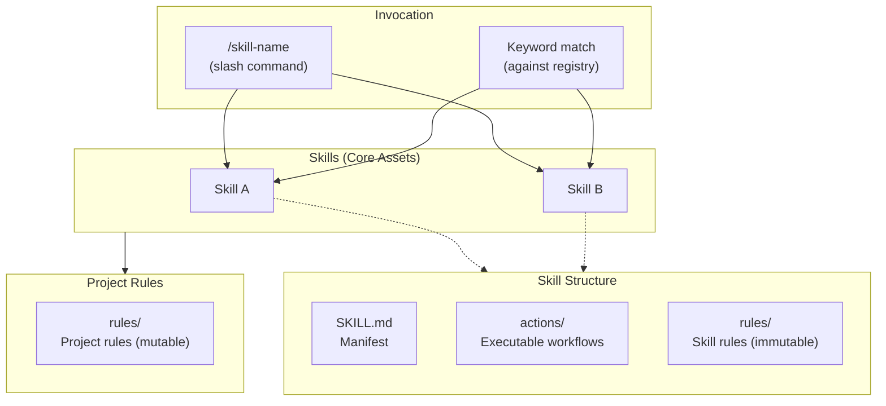

# AI Agent System

This folder contains the agent-system for this repository: skills and rules that AI assistants load to perform engineering work consistently. Start at [`AGENTS.md`](AGENTS.md) for the skill catalog and the Rules umbrella, tiers, mutability contract, and precedence model.

## Philosophy

- **Specialisation** — Each skill focuses on a specific domain, providing deep expertise
- **Isolation** — Sessions operate with focused context, reducing noise and improving accuracy
- **Composability** — Skills and rules can be mixed and matched per session as needed
- **Lazy Loading** — Load only the skills and rules relevant to the current task

## Architecture

The system uses a layered architecture where skills are the core assets, invoked by either a slash command or a keyword match against the skill registry:

### Layer Responsibilities

| Layer | Location | Purpose |
|-------|----------|---------|
| **Skills** | `skills/<domain>/` | Self-contained capability packages with actions and skill (immutable) rules |
| **Rules** | `rules/` | Project rules — customisable repo-specific guardrails that override skill rules by default |
