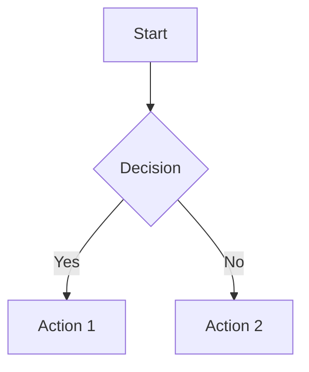

# Markdown Core Rule

## Variables

- Inherits `$AGENT_SYSTEM_FOLDER` and `$PROJECT_FOLDER` from root `AGENTS.md`

## Overview

Rules for Markdown authoring including document structure, formatting conventions, and content organisation.

## Principles

1. **Consistency** — Follow established conventions across all markdown documents
2. **Readability** — Optimise for human readability in both source and rendered form
3. **Accessibility** — Use semantic structure to support navigation and assistive technologies
4. **Tooling Support** — Write markdown that linters and formatters can validate automatically

## Heading Hierarchy

### ATX-Style Headings

All headings **MUST** use ATX-style (`#`) syntax:

```markdown
# Document Title
## Major Section
### Subsection
#### Detail
```

### Rules

- Each document **MUST** have exactly one H1 (`#`) heading as the document title
- Headings **MUST** be sequential — do not skip levels (e.g., `##` to `####`)
- Use H2 (`##`) for major sections within a document
- Use H3 (`###`) and H4 (`####`) for subsections and detail levels
- Leave a blank line before and after each heading

## Link Conventions

### Internal References

Use relative paths for links within the repository:

```markdown
<!-- Relative link to another file -->
[Core Rule](core.md)

<!-- Relative link to a file in another directory -->
[TypeScript Tooling](../../languages/typescript/tooling.md)
```

### External References

Use full URLs for external links:

```markdown
[markdownlint rules](https://github.com/DavidAnson/markdownlint/blob/main/doc/Rules.md)
```

### Link Text

Link text **MUST** be descriptive — do not use generic text like "click here" or "link":

```markdown
<!-- Good -->
See the [contributing guide](CONTRIBUTING.md) for details.

<!-- Bad -->
See [here](CONTRIBUTING.md) for details.
```

### Reference-Style Links

Use reference-style links when the same URL appears multiple times in a document:

```markdown
Read the [markdownlint documentation][markdownlint] for rule details.
Configure rules as described in the [markdownlint configuration][markdownlint].

[markdownlint]: https://github.com/DavidAnson/markdownlint
```

## List Formatting

### Unordered Lists

Use `-` (hyphen) for all unordered list items:

```markdown
- First item
- Second item
- Third item
```

### Nested Lists

Use 2-space indentation for nested lists:

```markdown
- Parent item
  - Child item
  - Another child
    - Grandchild item
```

### Ordered Lists

Use ordered lists (`1.`, `2.`, etc.) only for sequential steps or ranked items:

```markdown
1. Clone the repository
2. Install dependencies
3. Run the development server
```

## Code Blocks

### Fenced Code Blocks

All code blocks **MUST** use fenced syntax (triple backticks) with a language identifier:

````markdown
```typescript
const greeting: string = "Hello, world!";
```
````

| Language | Identifier |
|----------|------------|
| TypeScript | `typescript` |
| JavaScript | `javascript` |
| Bash/Shell | `bash` |
| JSON | `json` |
| YAML | `yaml` |
| Python | `python` |
| C# | `csharp` |
| Markdown | `markdown` |
| Plain text | `text` |
| Directory trees | (no identifier) |

### Inline Code

Use backticks for inline references to code, file names, commands, and configuration values:

```markdown
Run `npm install` to install dependencies.
Edit the `tsconfig.json` file.
Set the value to `true`.
```

## Frontmatter

### YAML Preamble

Documents that require metadata **MUST** use YAML frontmatter delimited by `---`:

```markdown
related: https://github.com/org/repo/issues/42

# Document Title

Content starts here.
```

### Common Fields

| Field | Purpose | Example |
|-------|---------|---------|
| `related` | Link to related issue, PR, or external resource | `https://github.com/org/repo/issues/42` |

Frontmatter **MUST** appear at the very top of the file, before the H1 heading.

## Mermaid Diagrams

### When to Use

Use Mermaid diagrams to visualise:

- Workflows and processes (flowcharts)
- System architecture and relationships (class diagrams, entity-relationship diagrams)
- Sequences of interactions (sequence diagrams)
- State transitions (state diagrams)

Prefer diagrams over lengthy prose when describing flows, dependencies, or architecture.

### Supported Diagram Types

| Type | Use Case |
|------|----------|
| `flowchart` | Process flows, decision trees |
| `sequenceDiagram` | API calls, system interactions |
| `classDiagram` | Object relationships, data models |
| `erDiagram` | Database schemas, entity relationships |
| `stateDiagram-v2` | State machines, lifecycle transitions |
| `gantt` | Timelines, project phases |

### Code Block Format

Mermaid diagrams **MUST** use fenced code blocks with the `mermaid` language identifier:

````markdown

````

## Table Formatting

### Structure

Tables **MUST** include a header row and a separator row:

```markdown
| Column 1 | Column 2 | Column 3 |
|----------|----------|----------|
| Value 1  | Value 2  | Value 3  |
```

### Guidelines

- Use pipes (`|`) to delimit columns
- Include a separator row with hyphens (`---`) between the header and body
- Align content for readability in source (optional but encouraged)
- Keep tables concise — use lists or subsections for complex data

## Naming Conventions

| Type | Convention | Example |
|------|------------|---------|
| Document files | kebab-case with `.md` extension | `core.md`, `development-environment.md` |
| Directory names | kebab-case | `git-workflow`, `decision-records` |
| Heading text | Sentence case | `## Script rules`, `### When to use` |
